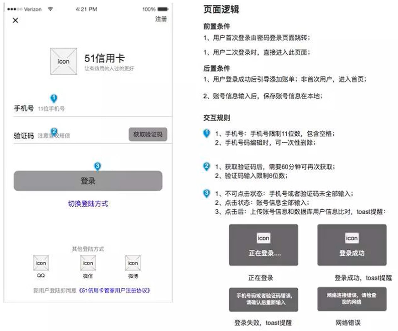

## 产品经理岗位要求的能力

- 基本功：产品设计、需求分析、竞品分析、数据分析、撰写文档
- 软实力：沟通能力、学习能力、用户思维、主动性、好奇心、同理心、责任心、抗压能力、目标导向...
- 扩展能力：商业思维、市场敏感度...

## 具备的技能

- 产品设计能力
- 需求分析能力
- 竞品分析能力
- 文档撰写能力
- 行业相关知识
- 产品运营能力
- 项目实战经验
- 产品思维

专业技术：业务分析、需求挖掘、需求分析、产品规划、产品设计、数据分析

能力素质：学习能力、沟通能力、情商高、抗压能力...

加分项：对某个行业领悟深、商业思维、项目管理、领导力、了解其他角色的知识

## 产品经理的定义

企业中专门负责产品管理的职位。产品经理负责市场调查，收集并分析产品、市场及用户等的需求；确定开发何种产品，选择何种业务模式、商业模式等；并推动相应产品的开发；根据产品的生命周期，协调研发、营销、运营等，确定和组织实施相应的产品策略，以及其他一系列相关的产品管理活动。

## 工作职责

- 确定产品类型
- 做好市场调查
- 确定用户需求
- 组织产品开发
- 协调运营推广

## 职责重点

- 设计方向：产品架构设计、结构设计、流程设计、原型设计（页面设计、功能设计）等
- 分析方向：市场调研，竞品分析、用户分析、需求分析、数据分析
- 文档方向：需求文档、会议文档、产品说明、帮助手册等
- 跟进方向：项目进度跟进、Bug修复跟进、发版跟进、UI跟进、客服跟进、测试跟进等
- 组织方向：组织项目立项、需求评审、项目总结等常见会议
- 沟通方向：与老板、市场、销售、渠道、客户、开发、运营、设计师、测试等沟通

## 按职级高低划分

- 产品助理/专员

  在领导和团队成员的安排下完成工作，偏产品设计的执行部分

- 产品经理

  完成需求分析及产品设计的工作，对行业和相关业务有认知，懂运营、懂数据、懂用户需求

- 高级产品经理

  负责产品或业务线的产品整个生命周期的工作，对行业熟悉，对业务熟悉，对业务熟练，对数据敏感，会带一些新人

- 产品总监

  产品负责人，一般负责战略方向及商业模式，团队管理，项目管理，为产品的方向和结果负责

## 按用户群体划分

- C端产品经理：面向用户是普通消费者
- B端产品经理：面向用户是公司或企业
- G端产品经理：面向用户是政府部门

## 按产品形态划分

- 移动端产品经理：主要做小程序、移动客户端相关的产品
- PC端产品经理：主要做PC客户端相关的产品
- WEB端产品经理：主要做浏览器端的产品

## 按工作内容划分

- 功能型产品经理

  专注于功能的设计，只需考虑如何将某个已经确定的需求转化为可以实现的功能

- 策略型产品经理

  专注于如何赚钱，重点是关注在怎样更好地去发掘出产品当中的盈利点

- 商业型产品经理

  专注于业务策略，重点是去考虑怎样用设计出更好的方案来满足业务的需求

- 数据产品经理

  通过数据挖掘产品的潜在机会，设计出更好的产品

- 硬件产品经理

  做实体硬件产品的产品设计

## 常用工具

- 原型工具：Axure RP、墨刀、Sketch
- 脑图工具：XMind、Mindmaster、ProcessOn
- 流程图工具：ProcessOn、Visio、亿图
- 团队协作：Tapd、teambition、禅道
- Office套件：Word、Excel、PPT

## 主要工作

- 启动

  - 行业调研

    工作内容：调研行业的发展现状及发展趋势，目的是为产品的发展方向提供依据

    工作产出：BRD,项目背景、商业价值、产品规划、盈利模式、收益与成本、风险与对策

  - 市场调研

    工作内容：在行业调研的基础上，瞄准某个市场，调研市场的情况，包括市场规模、用户信息等，从而确定产品的形态和业务。

    工作产出：MRD, 基本信息、市场说明、用户说明、产品说明

  - 立项

- 规划

  - 需求收集

    工作内容：从各种渠道收集产品的业务需求，渠道包括竞品、公司、运营、客服、商务等

    工作产出：竞品分析报告、SWOT分析、需求池

  - 需求分析

    工作内容：将收集来的业务需求，确定产品的业务场景，并转变成产品需求

    工作产出：产品功能清单

  - 流程设计

    工作内容：根据需求分析的结果，确定产品的业务流程

    工作产出：产品流程图

  - 结构设计

    工作内容：根据需求分析和流程设计，确定产品的结构

    工作产出：产品结构图、思维导图

- 执行

  - 原型设计

    工作内容：根据产品结构、流程和功能清单，设计产品的原型页面

    工作产出：产品原型图

  - 文档输出

    工作内容：根据原型图，撰写产品需求文档

    工作输出：PRD

  - 需求评审

    工作内容：与公司其他部门，包括运营、研发等部门，评审产品的需求，并最终定稿

    工作产出：PRD

- 跟进

  - 进度把控

    工作内容：跟进产品研发，包括UI设计、开发、测试等工作进度，并协调解决研发过程中遇到的问题

    工作产出：进度报告、优化后的PRD文档

  - 资源协调

    工作内容：对于研发过程中遇到的问题，及时协调部门内外的资源予以解决，比如增加人手、申请加班等

    工作产出：进度报告

- 收尾

  - 测试验收

    工作内容：在测试工程师完成测试之后，产品接入验收环节，验收通过几个上线

    工作产出：验收报告

  - 跟进上线

    工作内容：将验收通过的产品发布到对应的渠道

    工作产出：上线通知报告

