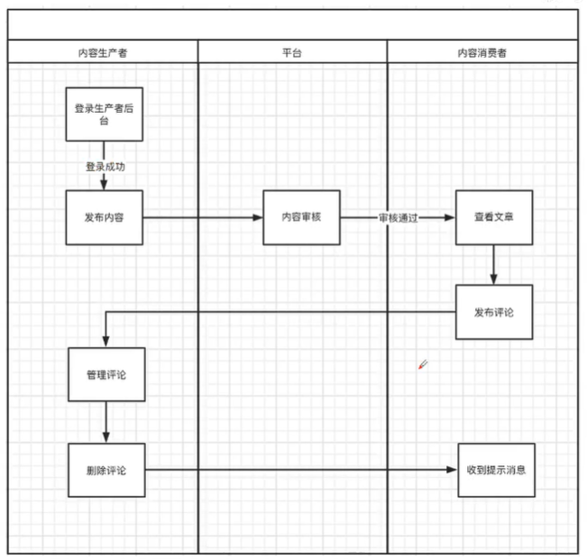
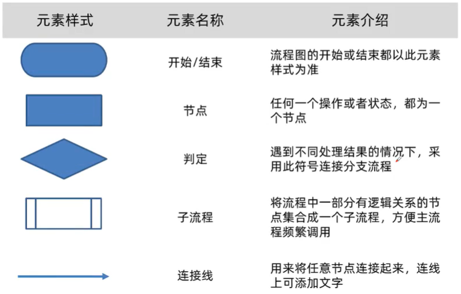
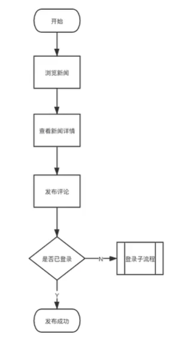
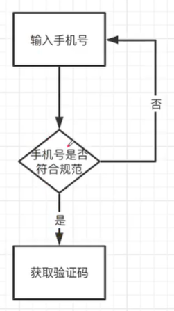
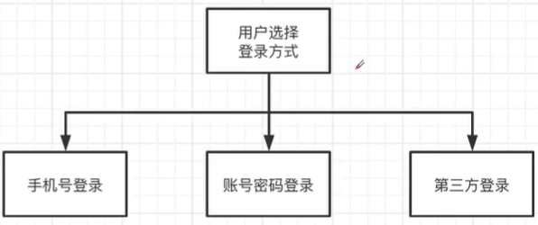
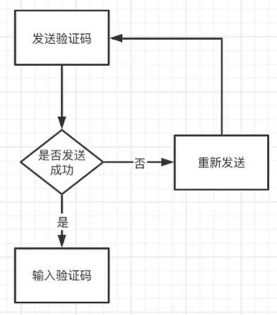

## 流程图

流程是为了达到特定的目的而进行的一系列有逻辑性的操作步骤，由两个及以上的步骤，完成一个完整的行为的过程，可称之为流程。

###为什么要绘制流程图

- 保证产品的使用逻辑合理顺畅
- 向项目组其他成员清晰地传达需求，用流程图来更好地表达产品逻辑
- 流程图可以帮助梳理模块、业务流程、使用路径

### 流程图分类

- 业务流程图

  描述业务流程的一种图。通过一些特定的符号和连线来表示具体某个业务的实际处理步骤和过程，详细地描述任务的流程走向。

- 功能流程图

  通过图形化的表达形式，阐述产品在功能层面控制的图表。主要在需求文档中为了帮助开发人员理解某个功能的具体的流程设计

- 页面流程图

  指产品具体所呈现的**页面跳转流程图**，其承载了业务流程图所包含的**业务流转**信息。为了帮助项目组成员（比如UI设计师）去更好地了解页面之间的流转关系。

### 流程图的组成元素

### 流程图常用结构

- 顺序结构：根据流程图的步骤，从上到下，从左到右，依次执行。

  

- 选择结构：二选一或者多选一

   

- 循环结构：循环执行

  

