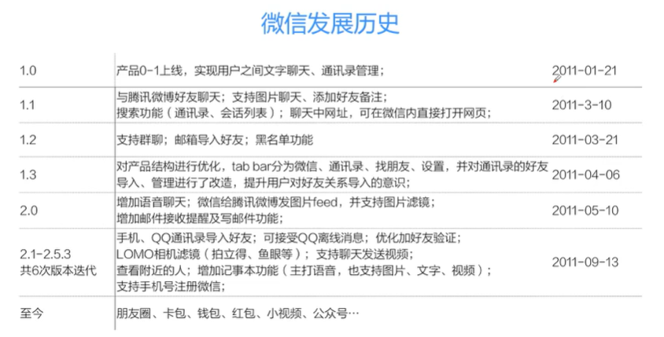
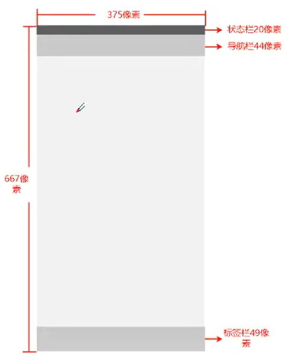
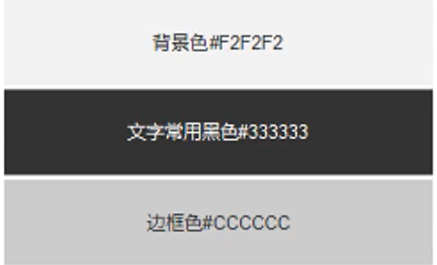
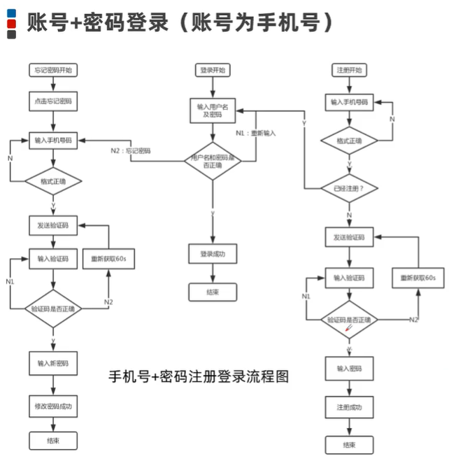
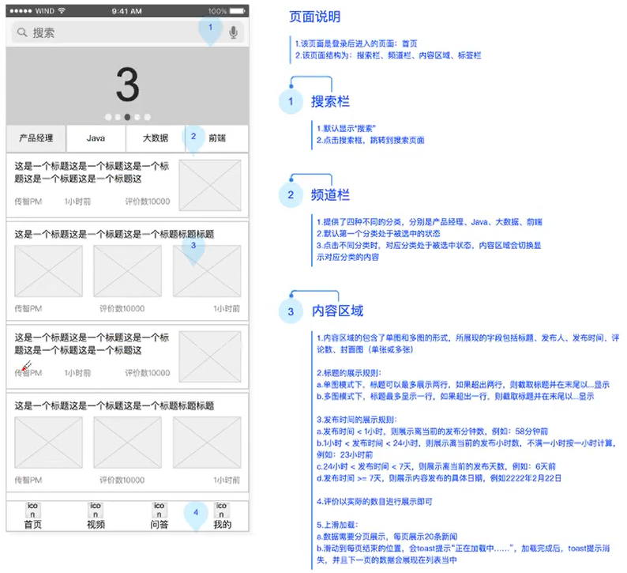
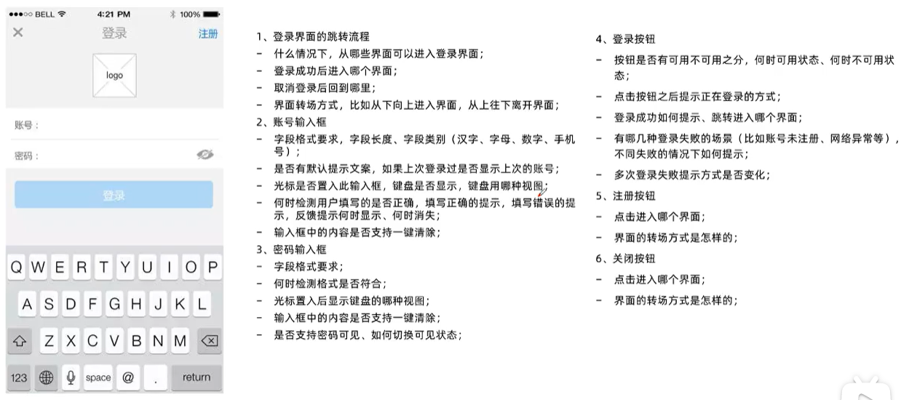

## 项目介绍

- 产品简介

  XX新闻是一款基于数据挖掘的推荐引擎产品，它为用户推荐有价值的、个性化的科技资讯，提供连接人与信息的新型服务。

- 产品描述

  基于个性化推荐引擎技术，根据每个用户的兴趣、爱好等多个维度进行个性化推荐，推荐内容为技术类文章、技术视频、科技资讯等内容。根据其阅读行为、地理位置、职业、年龄等挖掘出兴趣。

- 关键词：有态度的技术分享

- 产品定位：技术性头条

- 目标人群：IT行业从业者

- 使用场景：遇到技术难题时，查询解决方案；空闲时，查看最新科技资讯。

### MVP设计

硅谷创业家Eric Rise在其著作“精益创业”一书中提出了“精益创业”(Lean Startup)的理念，其核心思想是，开发产品时先做出一个简单的原型--最小可行产品(Minimum Viable Product, MVP)，然后通过测试并收集用户的反馈，快速迭代，不断修正产品，最终适应市场的需求。

### 低保真原型的绘制规范

- 尺寸规范

制作低保真原型图时，尺寸规范没有固定的尺寸要求，通常是根据适配机型来制作低保真原型，例如根据Iphone6适配的低保真原型图的尺寸为375x667。

| 宽高      | 状态栏  | 导航栏  | 标签栏  |
| ------- | ---- | ---- | ---- |
| 375x667 | 20   | 44   | 49   |

- 字体规范

  绘制原型时，为了使低保真原型图协调统一，需要注意字体规范，但是低保真原型图并没有既定的尺寸要求，一般情况下，导航栏内的标题字号要大于内容标题字号，内容标题字号要大于内容字号，一般选择阿里巴巴普惠体、微软雅黑、PingFang、Arial等常用字体。

- 配色规范

  原型中包含了多种颜色，但是在低保真原型中，没有具体颜色规范，除了元素自带的且不能更改的颜色外，一般采用黑白灰三色，以免妨碍UI设计师设计页面。

  

- 元件规范

  为了使原型图更清晰整齐，一般情况下，元件与元件之间需要对齐，善于使用网格、辅助线。

- 页面及页面命名规范

  - 有页面尽量分开展示
  - 页面的层级要有明显区分，为了快速找到页面，页面的名称一般可以采用页面的标题名

> 在绘制低保真原型图时，产品经理只需要注意功能完整、合理布局，美观度交由UI设计师即可。

### 绘制原型时的注意事项

- 前置条件
  - 确定导航架构，进而设计合理的产品结构图
  - 确认核心用户的使用流程
  - 确认原型默认状态(没有经过任何操作)
- 功能注意事项
  - 功能是否必须
  - 第一期该如何取舍功能
  - 技术实现成本是否能接受
  - 针对当前版本的优先级考虑，设计合理的功能
  - 功能图标的位置放置
  - 图片是否能查看大图，大图的展示形式
- 内容注意事项
  - 内容谁来更新，是否牵扯到运营端的职责，是的话如何配合
  - 如何让用户最快看到想要的，最快去掉不想要的内容，页面层级不要太深
  - 上线第一版如何让用户不感到内容过少
  - 内容该如何分类，分类是否具有可持续扩展性、合理
  - 内容的排序逻辑
  - 列表页为空时的显示效果
  - 列表页图片在文字左边还是右边
- 细节注意事项
  - 第一版冷启动，各种功能的引导功能和文案
  - 每个地方的引导文案，如何让用户无感觉自动被引导其他页面
  - 载入过慢时、断网时载入过程中的提示
  - 由WiFi切换4G时的是否下载消耗流量提醒
  - 按钮、图标、链接不可用时，如何呈现
  - 文本长度超过标准被截断时该如何显示
  - 确认button是在左边还是右边
  - 下拉框，列表框的默认定位
  - 时间的展示方式：YYYY-MM-DD或YY-MM-DD
  - 选中与被选中的状态

## 引导页、启动页、闪屏页

1. 什么是引导页，引导页的作用是什么？

   第一次安装app或者更新app后，第一次打开app时所展示的可以滑动的页面。

   主要是用于展示产品本身的一些核心功能点或者特色

2. 什么是启动页、启动页的作用是什么？

   App被用户打开后，在启动过程中被用户所看到的过渡页面。

   App打开的过程中需要一定的时间，启动页就是为了给用户一个过渡页面，缓解用户打开App时的焦虑心情。

3. 什么是闪屏页，闪屏页的作用是什么？

   一般是紧跟在启动页之后的页面。

   主要用于做一些开机的广告，可以是品牌的宣传，可以是商品的宣传，也可以是各种活动的宣传等。

   ​

## 登录流程

## 交互说明

- 交互说明可以看做交互设计师或产品经理输出的最核心的“产品”
- 交互说明面向的“用户”是下游的同事--UI设计师、开发工程师和测试工程师

交互说明主要包括以下3个维度：

- 页面流程

  可以表达产品的整体结构，帮助同事了解界面之间的关系。一般来说，页面间的流程要通过原型的结构来体现。

- 内容布局

  - 页面什么结构，有哪些模块，基本的布局
  - 显示什么样的数据(文本、图片、视频、音频)，显示样式或格式是什么样的？数据从哪里来的？
  - 说明不同状态下的显示规则(比如登录、加载、角色、网络、有无内容等)

- 交互操作与反馈

  页面中的控件操作有什么效果，会跳转到哪里去；另外，还有注意交互的数据逻辑(限制条件)和异常反馈(操作错误)

交互说明撰写思路

1. 先写页面有哪些功能模块，比如导航栏、列表等
2. 在每个模块写，看到了哪些数据(图文、音频等)
3. 这些数据是怎么来的，比如用户发布、系统自动生成等
4. 再写数据的显示格式，比如长度、行数、数量、有无等
5. 写完看到什么，再写能做什么，即有哪些操作、比如点击、输入、滑动等
6. 操作的反馈，比如跳转新页面、弹框提示、toast提示等
7. 操作的限制条件，比如不同角色、不同等级、是否登录、网络状态等
8. 异常操作的反馈，比如输入错误等

交互说明规范

- 页面说明：先将整体页面结构进行划分；如有必要，描述清楚相关路径
- 标注+命名：将原型按照划分好的结构进行标注和命名
- 撰写说明：区域页面描述、区域功能描述

注意事项

- 原型要先画默认状态(没有任何操作之前的状态)，然后再绘制交互后的效果；
- 产品经理在设计交互逻辑时，为了避免让用户陷入更深层级中，一般要求单流程做多跳三级，常见的临时视图不占次数；
- 在设计强制执行页面时(如强制注册)，一般不提供其他跳转出口，让用户保持高度专注，形成逻辑闭环，减少错误发生；(**慎用**)
- 弱执行流程(比如浏览、查看详情等)可提供跳转出口(如分享)，增加流量；
- 完成阶段一般可以设置快速返回，让用户更快从深层方回。

