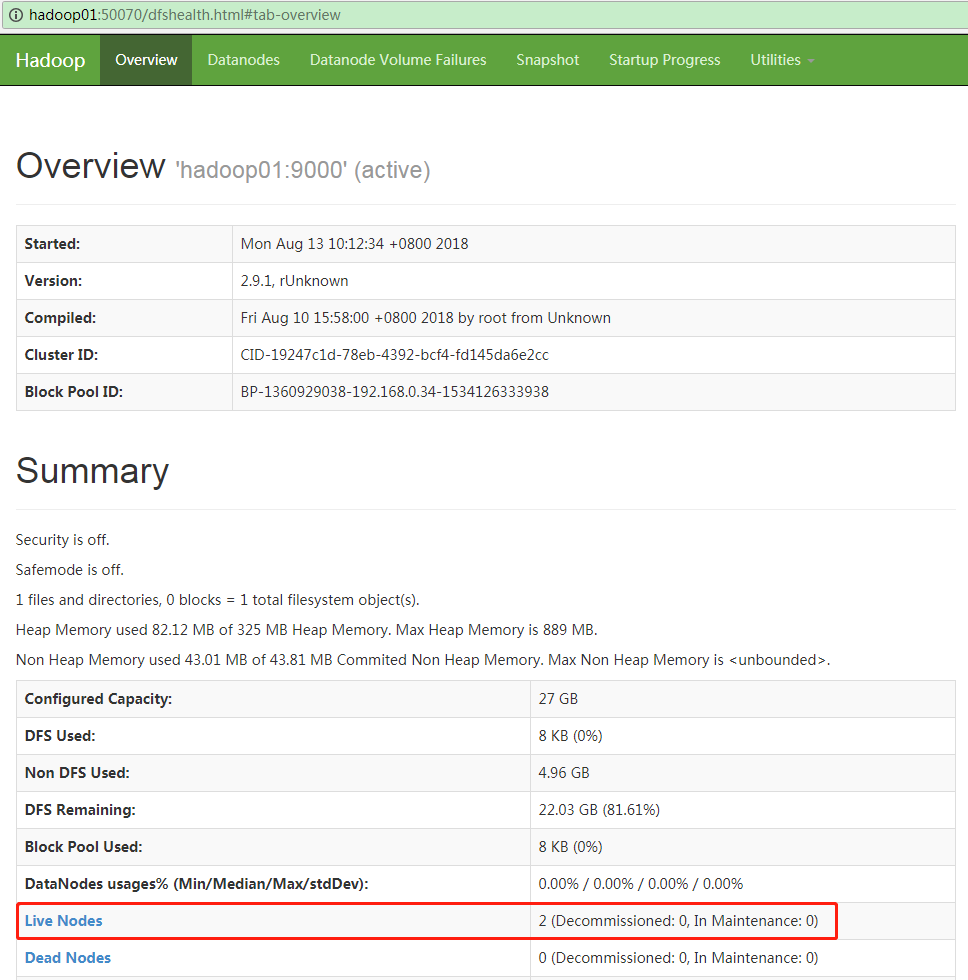
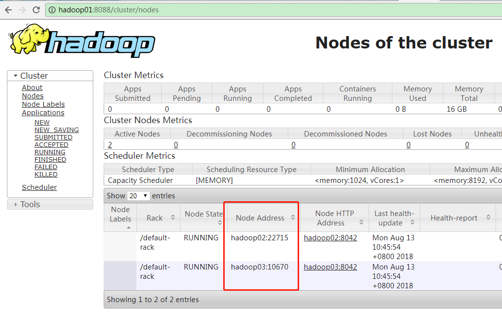

# 安装和配置Hadoop集群(3节点)

分布式存储和分布式运算是Hadoop提供的核心功能。这篇文章将在单机安装的基础上，进行3个节点Hadoop集群的安装，Hadoop版本为2.9.2。

## Hadoop集群的守护进程

Hadoop自2.0版本开始，采用独立的YARN来进行集群内的资源管理。因此，部署时会有两套集群，一套YARN，一套HDFS，可以独立运行。在我们的部署中，为了节约资源，YARN的主节点和HDFS的主节点位于同一主机，YARN的从节点和HDFS的从节点位于同一主机。

下面是HDFS集群和YARN集群的主要结构，“节点”或者“管理器”，其实际的表现形式都是一个Java守护进程。

**HDFS集群**：

- NameNode（名称节点）：有时候也叫MasterNode（主节点），它不保存实际数据，只保存元数据（数据块的数目、大小、存储位置）。它也维护着文件系统的命名空间和路径信息。名称节点应当位于可靠的服务器上。
- SecondaryNameNode（第二名称节点）：用于在名称节点失效时进行替换。
- DataNode（数据节点）：有时候也叫SlaveNode（从节点）。它保存实际的数据，根据名称节点的指令，执行数据块的创建、删除、复制。数据节点的数量可以很庞大，但对服务器的要求不高。

**YARN集群**：

YARN（Yet Another Resource Negotiator，又一款资源协调器），管理和监控集群的负载，并进行作业分配，有时也被称为Hadoop的数据操作系统，由ResourceManage和NodeManager组成。

- ResourceManager（资源管理器）：YARN的主节点，RM管理着全局资源（CPU和内存）在所有应用中的分配。所有的作业（Jobs，例如MapReduce）都会提交到此节点，然后它再分配任务（Tasks）到从节点。
- NodeManager（节点管理器）：YARN的从节点，NM用于监控资源的使用情况，并汇报给主节点。

了解了集群的机构后，下面就可以开始一步步进行部署了。

借助ssh、scp两个工具，可以将一条命令同时在3个主机间执行（或者传送文件）。

## 配置运行环境

### 修改主机名

将三台主机分别命名为了hadoop01、hadoop02、hadoop03。有人习惯根据服务器的职责，使用 hadoop-master，hadoop-slave，或者 hadoop-name，hadoop-data 来对服务器进行命名。

```bash
hostnamectl set-hostname hadoop01
```

修改完后退出，重新登录，会看到主机名已经发生了变化。

将其他两台名称修改为 hadoop02、hadoop03。

### 配置hosts

三台主机的IP、ssh端口、职责、名称分别如下：

| IP            | ssh port | 职责                                       | 名称     |
| :------------ | :------- | :----------------------------------------- | :------- |
| 192.168.1.131 | 60034    | NameNode SecondaryName NodeResourceManager | hadoop01 |
| 192.168.1.132 | 60034    | DataNode NodeManager                       | hadoop02 |
| 192.168.1.133 | 60034    | DataNode NodeManager                       | hadoop03 |

安全起见，将ssh的默认端口由22改为了60034，所以下面的很多命令都带了-p/-P参数，如果使用22端口，则无需指定。

修改/etc/hosts：

```bash
echo "192.168.1.131 hadoop01" >> /etc/hosts
echo "192.168.1.132 hadoop02" >> /etc/hosts
echo "192.168.1.133 hadoop03" >> /etc/hosts
```

### 配置SSH免密登录

启动集群时，因为要在一台机器上执行命令启动集群中的所有节点，因此节点间需要能够通过ssh登录。

### 安装OpenJDK

#### 拷贝~/.bashrc至其他主机

```bash
for i in {2..3}; do
  scp -P 60034 ~/.bashrc hadoop0${i}:~/.bashrc
  ssh -p 60034 root@hadoop0${i} "source ~/.bashrc"
done
```

ssh的-p是小写，scp的-P是大写。

## 安装Hadoop

集群安装Hadoop和单机安装是类似的。

### 从hadoop01拷贝至其他主机

```bash
for i in {2..3}; do
scp -P 60034 ~/downloads/hadoop-2.9.2.tar.gz hadoop0${i}:~/downloads/hadoop-2.9.2.tar.gz;
done
```

### 安装hadoop

```bash
for i in {1..3}; do
ssh -p 60034 root@hadoop0${i} "tar -xzvf ~/downloads/hadoop-2.9.2.tar.gz -C /opt"
done
```

### 配置环境变量

```bash
# vim ~/.bashrc

export HADOOP_HOME=/opt/hadoop-2.9.2
export HADOOP_INSTALL=$HADOOP_HOME
export HADOOP_MAPRED_HOME=$HADOOP_HOME
export HADOOP_HDFS_HOME=$HADOOP_HOME
export HADOOP_COMMON_HOME=$HADOOP_HOME
export HADOOP_CONF_DIR=$HADOOP_HOME/etc/hadoop

export YARN_HOME=$HADOOP_HOME
export YARN_CONF_DIR=$HADOOP_HOME/etc/hadoop

export PATH=$PATH:$HADOOP_HOME/sbin:$HADOOP_HOME/bin
```

将~/.bashrc拷贝至其他主机，和java部分相同，就不重复了。

因为修改了ssh的默认端口号，也要对此进行配置：

```bash
# vim $HADOOP_CONF_DIR/hadoop-env.sh 

export HADOOP_SSH_OPTS="-p 60034"
```

## 配置Hadoop

### 配置NameNode

```xml
# vim $HADOOP_CONF_DIR/core-site.xml

<configuration>
    <property>
        <name>fs.defaultFS</name>
        <value>hdfs://hadoop01:9000</value>
    </property>
    <property>
        <name>hadoop.tmp.dir</name>
        <value>/data/hadoop</value>
    </property>
</configuration>
```

ds.defaultFS指定了hdfs的默认路径；hadoop.tmp.dir指定了hadoop文件存放路径的根目录。

### 配置HDFS

```xml
# vim $HADOOP_CONF_DIR/hdfs-site.xml

<configuration>
    <property>
            <name>dfs.namenode.name.dir</name>
            <value>file:///data/hadoop/dfs/name</value>
    </property>
    <property>
            <name>dfs.datanode.data.dir</name>
            <value>file:///data/hadoop/dfs/data</value>
    </property>
    <property>
        <name>dfs.replication</name>
        <value>2</value>
    </property>
    <property>
        <name>dfs.namenode.secondary.http-address</name>
        <value>hadoop01:50090</value>
    </property>
    <property>
        <name>dfs.namenode.secondary.https-address</name>
        <value>hadoop01:50091</value>
    </property>
</configuration>
```

可以不用设置dfs.namenode.name.dir和dfs.datanode.data.dir，因为它们的值/data/hadoop会继承自core-site.xml中的hadoop.tmp.dir。

dfs.replication设置副本数量，因为3节点中只有2个DataNode，因此此处为2，默认是3。

### 配置MapReduce

```xml
# vim $HADOOP_CONF_DIR/mapred-site.xml

<configuration>
    <property>
        <name>mapreduce.framework.name</name>
        <value>yarn</value>
    </property>
</configuration>
```

YARN是一个通用的资源协调器，不仅可以为MapReduce服务，也可以为Spark、Tez等应用服务。

### 配置YARN

```xml
# vim $HADOOP_CONF_DIR/yarn-site.xml

<configuration>
    <property>
        <name>yarn.nodemanager.aux-services</name>
        <value>mapreduce_shuffle</value>
    </property>
    <property>
        <name>yarn.resourcemanager.hostname</name>
        <value>hadoop01</value>
    </property>
</configuration>
```

### 配置salves文件

我们使用hadoop01来作为NameNode，hadoop02、hadoop03作为DataNode。slaves默认只有一行内容：localhost，使用vim编辑slaves，并写入下面内容：

```properties
# vim $HADOOP_CONF_DIR/slaves

hadoop02
hadoop03
```

### 拷贝所有配置文件到hadoop02、hadoop03

上面的所有配置文件的修改都是在hadoop01上完成的，需要把它们复制到其他两台机器上，同样是使用scp工具来完成：

```bash
for i in {2..3}; do
scp -P 60034 $HADOOP_HOME/etc/hadoop/* hadoop0${i}:$HADOOP_HOME/etc/hadoop/;
done
```

## 启动Hadoop

### 格式化NameNode

```bash
hdfs namenode -format
```

这个命令非常危险！你应当只在新建集群后执行一次，因为namenode保存的是HDFS的所有元信息，如果丢失了，整个集群中DataNode的数据都无法访问，就算它们还在磁盘上。

### 启动HDFS

```bash
start-dfs.sh
```

### 查看NameNode的Web UI

使用浏览器打开[http://hadoop01:50070](http://hadoop01:50070/)，正常应该可以看到下面的页面：



Hadoop NameNode Web UI

用windows电脑需要和linux位于同一局域网，并且配置了hosts才可以通过上面的地址访问。在生产环境通常是不能的（需要访问授权，搭建前端的nginx服务器等）。

### 查看HDFS进程

在NameNode（hadoop01）上执行jps：

```bash
# jps

12119 NameNode
12332 SecondaryNameNode
12478 Jps
```

在DataNode（hadoop02/hadoop03）上执行jps：

```bash
# jps

18208 DataNode
18296 Jps
```

### 停止HDFS

```bash
# stop-dfs.sh

Stopping namenodes on [hadoop01]
hadoop01: stopping namenode
hadoop02: stopping datanode
hadoop03: stopping datanode
Stopping secondary namenodes [hadoop01]
hadoop01: stopping secondarynamenode
```

### 运行YARN

```bash
# start-yarn.sh

starting yarn daemons
starting resourcemanager, logging to /opt/hadoop-2.9.2/logs/yarn-root-resourcemanager-hadoop01.out
hadoop02: starting nodemanager, logging to /opt/hadoop-2.9.2/logs/yarn-root-nodemanager-hadoop02.out
hadoop03: starting nodemanager, logging to /opt/hadoop-2.9.2/logs/yarn-root-nodemanager-hadoop03.out
```

### 查看ResourceManager的Web UI

当启用YARN之后，就可以查看ResourceManager的Web UI了，使用浏览器打开[http://hadoop01:8088](http://hadoop01:8088/)。



Hadoop ResourceManager Web UI

### 查看YARN进程

在ResourceManager（hadoop01）上执行jps：

```bash
# jps

12119 NameNode
12551 ResourceManager
12332 SecondaryNameNode
12846 Jps
```

在NodeManager（hadoop02/hadoop03）上执行jps：

```bash
# jps

18208 DataNode
18355 NodeManager
18502 Jps        
```

### 停止YARN

```bash
# stop-yarn.sh

stopping yarn daemons
stopping resourcemanager
hadoop02: stopping nodemanager
hadoop03: stopping nodemanager
hadoop02: nodemanager did not stop gracefully after 5 seconds: killing with kill -9
hadoop03: nodemanager did not stop gracefully after 5 seconds: killing with kill -9
no proxyserver to stop
```

## 总结

至此，一个三节点的Hadoop集群就搭建完毕了。Hadoop的配置纷繁复杂，这里没有涉及过多的深度配置，例如内存调优等。