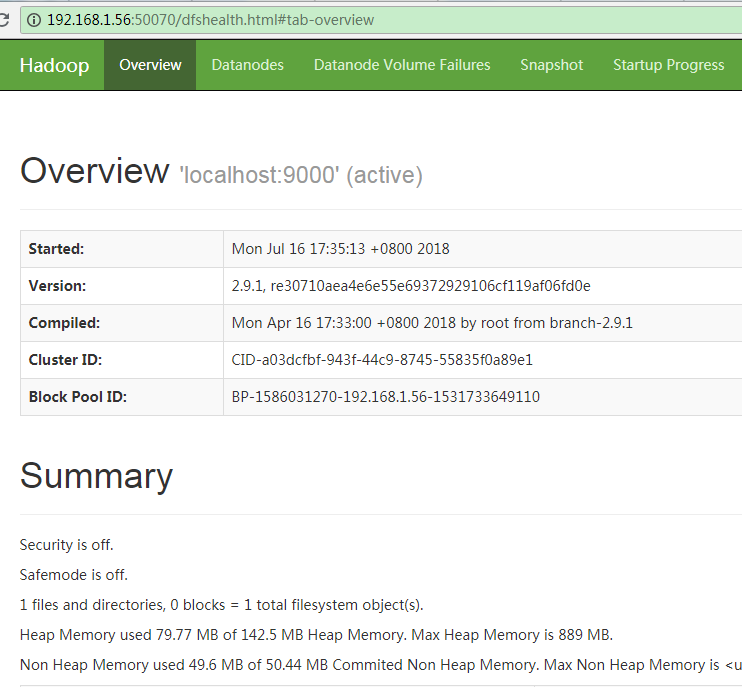
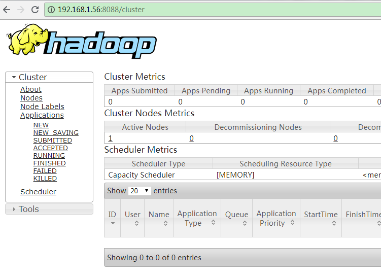

# Hadoop安装和配置(单节点)

Hadoop有三种安装方式：独立（Standalone），单机单进程；伪分布（Pseudo-Distributed），单机多进程；完全分布（Fully-Distributed），多机多进程。这篇文章记录了伪分布模式安装的步骤，Hadoop版本为2.9.2。

## 1. 配置运行环境

### 1.1 安装OpenJDK

### 1.2 配置SSH免密登录

因为只有一台主机，所以只要配置本机的ssh登录就可以了。当构建集群的时候，免密登录可以方便地使用scp工具在多个主机之间拷贝文件，从而方便部署。

### 1.3 安装rsync

rsync，是一个远程数据同步工具，可通过LAN/WAN快速同步多台主机间的文件。rsync使用所谓的“rsync算法”来使本地和远程两个主机之间的文件达到同步，这个算法只传送两个文件的不同部分，而不是每次都整份传送，因此速度相当快。使用yum来进行安装：

```bash
yum install -y ssh rsync
```

## 2. 下载和安装

前往hadoop的官网获取下载链接：https://hadoop.apache.org/releases.html

Linux下可用命令wget下载，如：

```bash
wget http://apache.communilink.net/hadoop/common/hadoop-2.9.2/hadoop-2.9.2.tar.gz  
```

解压缩到/opt/hadoop文件夹：

```bash
 mkdir /opt/hadoop
 tar -xzvf hadoop-2.9.2.tar.gz -C /opt/hadoop
```

## 3. 配置环境变量

使用vim编辑~/.bashrc文件，在最底部写入下面内容：

```bash
export HADOOP_HOME=/opt/hadoop/hadoop-2.9.2 
export HADOOP_INSTALL=$HADOOP_HOME
export HADOOP_MAPRED_HOME=$HADOOP_HOME
export HADOOP_COMMON_HOME=$HADOOP_HOME
export HADOOP_HDFS_HOME=$HADOOP_HOME
export YARN_HOME=$HADOOP_HOME 
export HADOOP_COMMON_LIB_NATIVE_DIR=$HADOOP_HOME/lib/native
export HADOOP_OPTS="-Djava.library.path=$HADOOP_HOME/lib/native"
export PATH=$PATH:$HADOOP_HOME/sbin:$HADOOP_HOME/bin 
```

然后通过source命令，使得变量立即生效：

```bash
source ~/.bashrc
```

## 4. 配置Hadoop

### 4.1 编辑core-site.xml

该文件位于 $HADOOP_HOME/etc/hadoop/core-site.xml，按如下进行配置：

```xml
<configuration>
    <property>
        <name>fs.defaultFS</name>
        <value>hdfs://localhost:9000</value>
    </property>
    <property>
        <name>hadoop.tmp.dir</name>
        <value>/data/hadoop</value>
    </property>
</configuration>
```

### 4.2 编辑hdfs-site.xml

该文件位于 $HADOOP_HOME/etc/hadoop/hdfs-site.xml，按如下进行配置：

```xml
<configuration>
    <property>
        <name>dfs.replication</name>
        <value>1</value>
    </property>
</configuration>
```

### 4.3 编辑mapred-site.xml

这个文件需要通过 $HADOOP_HOME/etc/hadoop/mapred-site.xml.template创建（复制并重命名）。它用于将资源管理器配置为YARN。

```bash
cd $HADOOP_HOME/etc/hadoop
cp mapred-site.xml.template mapred-site.xml
```

编辑内容，如下所示：

```xml
<configuration>
    <property>
        <name>mapreduce.framework.name</name>
        <value>yarn</value>
    </property>
</configuration>  
```

### 4.4 编辑yarn-site.xml

该文件位于 $HADOOP_HOME/etc/hadoop/yarn-site.xml，编辑内容如下：

```xml
<configuration>
    <property>
        <name>yarn.nodemanager.aux-services</name>
        <value>mapreduce_shuffle</value>
    </property>
</configuration>
```

## 5. 启动Hadoop

### 5.1 格式化namenode

第一次使用前，可以先对namenode进行格式化：

```bash
hdfs namenode -format
```

### 5.2 运行HDFS

```bash
start-dfs.sh
```

### 5.3 查看NameNode的Web UI

假设Hadoop安装的机器IP是192.168.1.56，那么使用浏览器打开：http://192.168.1.56:50070。可以看到下面这样的Web界面：



图1. Hadoop NameNode Web UI

**注意：**如果打不开，首先检查是不是防火墙的问题，建议可以先关闭防火墙，以排除这个因素。

### 5.4 运行YARN

```bash
 start-yarn.sh
```

### 5.5 查看ResourceManager的Web UI

当启用YARN之后，就可以查看ResourceManager的Web UI了，使用浏览器打开http://192.168.1.56:8088：



图2. Hadoop YARN ResourceManager Web UI

### 5.6 检查所有进程的运行情况

可以通过jps命令来查看进行的运行状况：

## 6. 停止Hadoop

### 6.1 停止HDFS

```bash
stop-dfs.sh
```

### 6.2 停止YARN

```bash
stop-yarn.sh
```