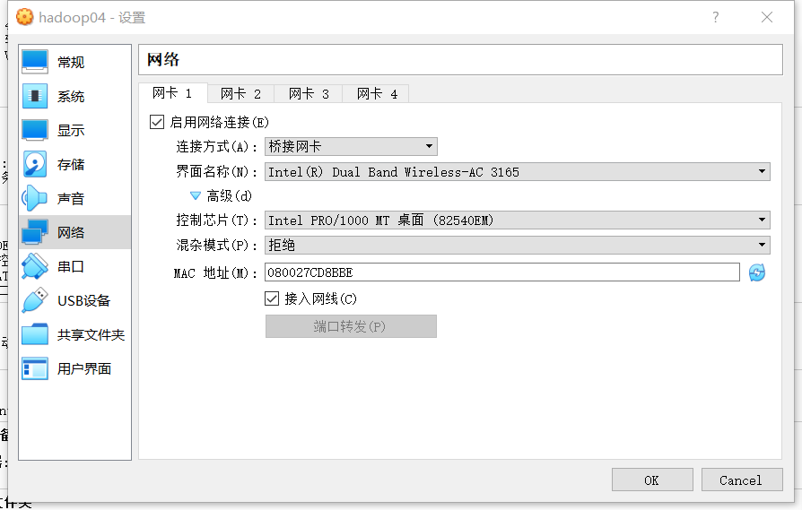

# 网络配置

## 1. 查看、启动、停止

```cmd
systemctl status network
systemctl start network
systemctl stop network
systemctl restart network
```

## 2. 配置网卡

文件：/etc/sysconfig/network-scripts/ifcfg-enp0s3

```ini
TYPE=Ethernet
PROXY_METHOD=none
BROWSER_ONLY=no
# BOOTPROTO=dhcp
DEFROUTE=yes
IPV4_FAILURE_FATAL=no
IPV6INIT=yes
IPV6_AUTOCONF=yes
IPV6_DEFROUTE=yes
IPV6_FAILURE_FATAL=no
IPV6_ADDR_GEN_MODE=stable-privacy
NAME=enp0s3
UUID=685c52f7-c86d-4396-8112-e10f7c3205e7
DEVICE=enp0s3
ONBOOT=yes

IPADDR=192.168.1.131
NETMASK=255.255.255.0
GATEWAY=192.168.1.1
DNS1=211.161.78.1
DNS2=211.161.78.10
```

## 3. 域名解析

文件：/etc/resolv.conf

```ini
# Generated by NetworkManager
nameserver 211.161.78.1
nameserver 211.161.78.10
```

## 4. 自动获取域名解析

文件：/etc/sysconfig/network-scripts/ifcfg-enp0s3

```ini
# 打开dhcp
BOOTPROTO=dhcp

# 注释静态配置，检查/etc/resolv.conf
# IPADDR=192.168.1.131
# NETMASK=255.255.255.0
# GATEWAY=192.168.1.1
# DNS1=211.161.78.1
# DNS2=211.161.78.10
```

## 5. 主机名称

文件：/etc/hostname

```ini
centos7-1
```

更改主机名

```bash
hostnamectl set-hostname hadoop01
```


## 6. 防火墙

```cmd
# 查看防火墙状态
firewall-cmd --state

# 停止防火墙
systemctl stop firewalld.service

# 禁止开机启动
systemctl disable firewalld.service
```

## 7. VirtualBox中的网卡配置



